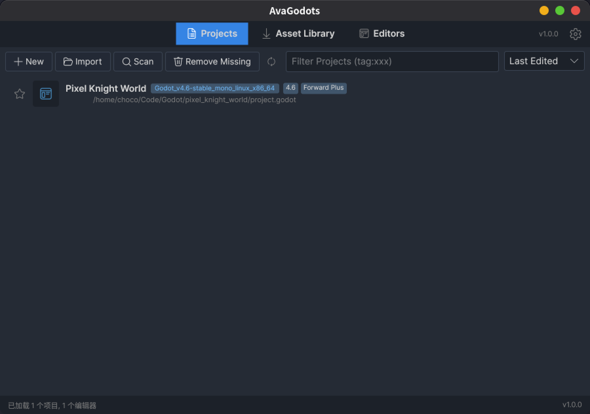
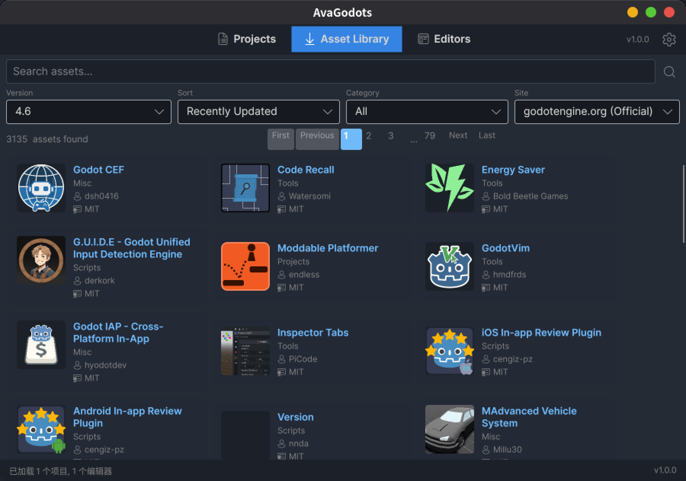
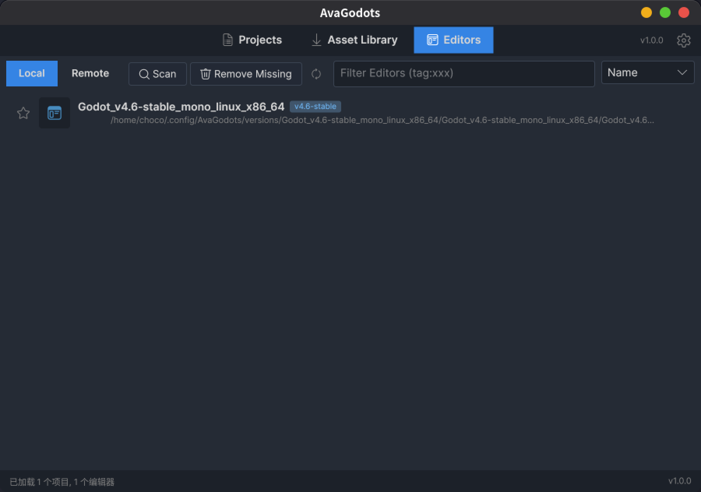
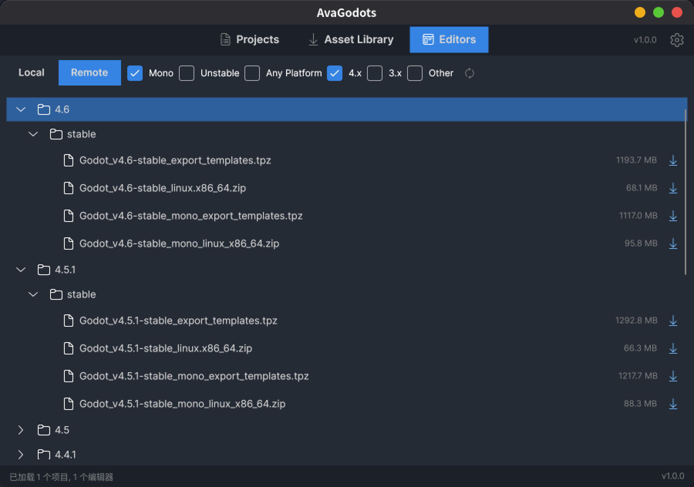
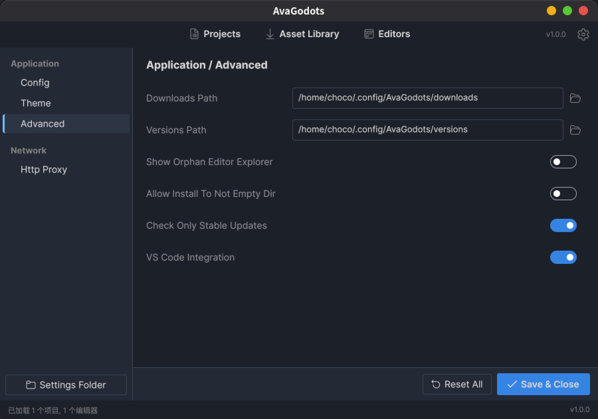

# AvaGodots

A lightweight cross‑platform Godot editor manager built with Avalonia UI and .NET.

- Browse, download and install Godot editor builds (official and build variants)
- Manage local editors and project bindings
- Download export templates and manage projects
- Cross-platform desktop GUI (Windows, macOS, Linux)

---

## Quick start (development)

Requirements

- .NET 10 SDK or later
- Git

Run locally

1. Clone the repo:

    ```shell
    git clone https://github.com/WangWindow/AvaGodots.git
    cd AvaGodots
    ```

1. Build and run the desktop app:

    ```shell
    dotnet build
    dotnet run --project AvaGodots.Desktop
    ```

1. The UI opens — use the `Editors` tab to browse local and remote Godot editor builds.

---

## Screenshots

Below are a few screenshots showcasing the app UI and primary features (files located in `assets/screenshots`).

- `image1.png` — **Main window**: editors list and local/remote status.
- `image2.png` — **Editor details & download**: view versions, download/install controls.
- `image3.png` — **Project bindings**: attach projects to installed editors.
- `image4.png` — **Download manager**: active downloads and progress view.
- `image5.png` — **Settings & localization**: app preferences and language selection.

<p align="center">
  
  <br/>
  <em>Main window — editors list and status</em>
</p>

<p align="center">
  
  
  <br/>
  <em>Editor details & downloads (left) — Project bindings (right)</em>
</p>

<p align="center">
  
  
  <br/>
  <em>Download manager (left) — Settings & localization (right)</em>
</p>

---

## Release workflow (CI)

This repository includes a GitHub Actions workflow that creates cross‑platform release artifacts when a tag is pushed (tags starting with `v`). The workflow builds for Linux, Windows and macOS, packages each build and creates a GitHub Release with the artifacts.

To publish a release from your local machine:

```bash
git tag vX.Y.Z
git push origin vX.Y.Z
```

GitHub Actions will run and attach platform artifacts to the new release.

---

## Contributing

- Open issues for bugs or feature requests.
- Create a branch per change and submit a PR with a clear description.
- Follow existing code style and add unit tests where appropriate.

---

## License

This project is licensed under the MIT License — see the `LICENSE` file for details.
